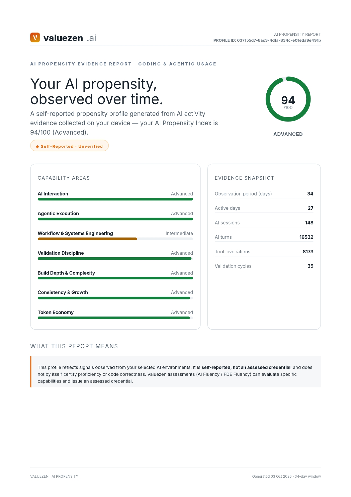
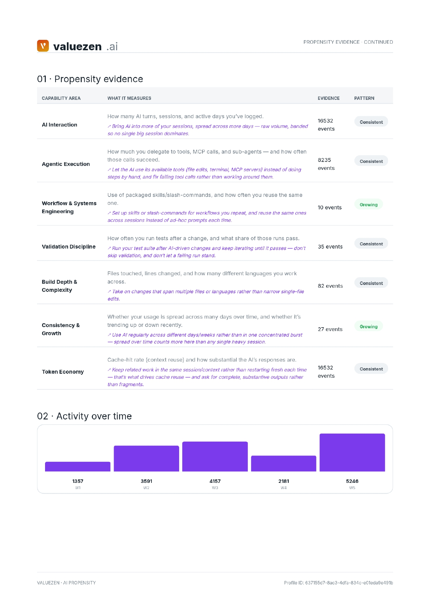
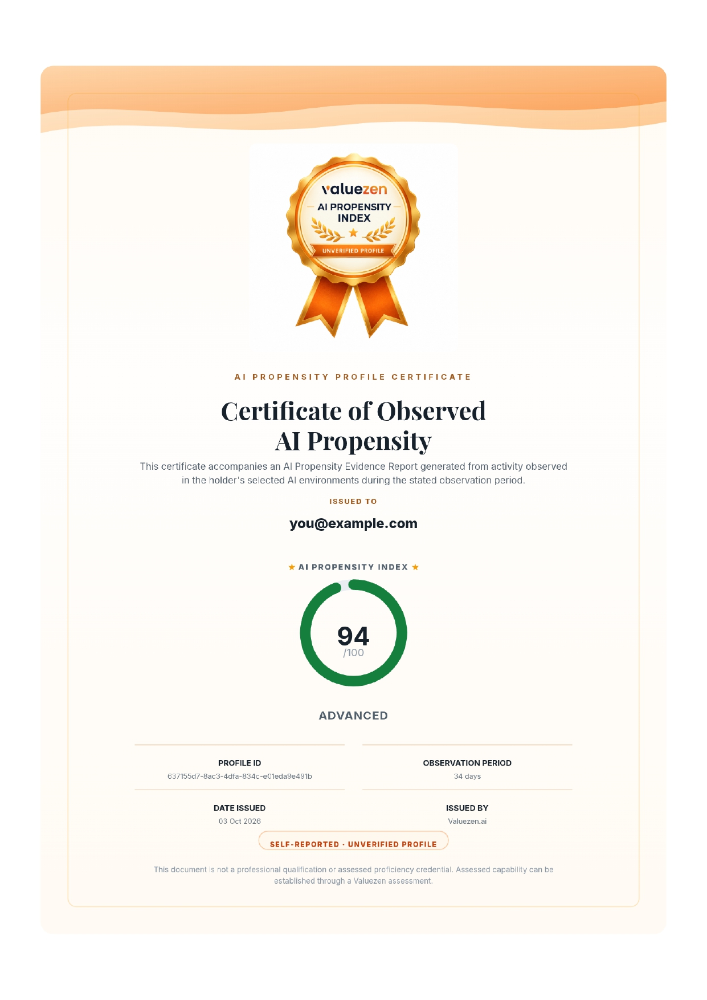

<div align="center">

# 🧭 AI Propensity Signal Collector

**Where are you on the journey from AI-curious to AI-native?**

*Free · Open-source · Privacy-first · No sign-up to preview*

[](https://www.python.org/)
[](#-requirements)
[](#-dont-take-our-word-for-it--see-exactly-what-gets-sent)
[](#-why-this-exists)
[](#-requirements)
[](https://github.com/ValueZen-ai/ai-propensity/pulls)

[🚀 Quickstart](#-quickstart) ·
[🔍 What gets sent](#-dont-take-our-word-for-it--see-exactly-what-gets-sent) ·
[🔌 Install](#-install--claude-code-adapter) ·
[⌨️ Usage](#%EF%B8%8F-usage) ·
[📚 Reference](#-reference) ·
[🌐 Upload](https://app.valuezen.ai/ai-native)

</div>

---

This tool extracts AI propensity signals — metadata about how you use AI, never the content of what you asked or built — from **Claude Code**, **Codex**, **Claude.ai**, and **ChatGPT**, and turns them into your **AI Propensity Index** on Valuezen. Takes under a minute. Runs entirely on your own device.

```text
 💻 Local AI history  ──▶  🧹 Metadata only  ──▶  📄 One JSON file  ──▶  🌐 Upload (you choose)  ──▶  📈 Your Index
 (Claude Code, Codex,      (no prompts, no        (you can read it)      app.valuezen.ai/ai-native
  Claude.ai, ChatGPT)       code, no replies)
```

## 📑 Table of contents

- [What is "AI propensity"?](#-what-is-ai-propensity)
- [Why this exists](#-why-this-exists)
- [What it does](#-what-it-does)
- [Quickstart](#-quickstart)
- [What you get](#-what-you-get)
- [See exactly what gets sent](#-dont-take-our-word-for-it--see-exactly-what-gets-sent)
- [Requirements](#-requirements)
- [Install](#-install--claude-code-adapter) — [Claude Code](#-install--claude-code-adapter) · [Codex](#-install--codex-adapter) · [claude-web / chatgpt](#-install--claude-web--chatgpt-adapters-export-import)
- [Usage](#%EF%B8%8F-usage)
- [Export to Valuezen](#-export-to-valuezen)
- [Reference](#-reference)

## 🧠 What is "AI propensity"?

**AI propensity is a measure of how much you actually lean on AI in real work and conversation, and how that usage behaves over time** — not a quiz score, not a certification, and not something you can cram for. It's inferred from the *metadata* your everyday AI tools already generate as a byproduct of you using them: how often you start sessions, how many turns a conversation runs, how much of your output involves AI-touched files, whether your tests still pass afterward, whether you're refining prompts or accepting the first answer. None of that requires reading a single prompt, response, or line of code — the pattern of usage is the signal, not the content.

This repo is the tool that extracts that metadata, locally, and packages it into one file you choose to upload. Valuezen turns that file into your AI Propensity Index — an evidence-based, self-reported starting point, not a verdict on how "AI-native" you are.

**Propensity is step one of a longer journey, not the destination.** It's an early, observed signal — deliberately unverified, because it's self-reported from your own local history. From there the path runs:

| Step | Stage | What it is |
|:---:|---|---|
| 1️⃣ | 🌱 **AI Propensity** *(this tool — where you start)* | Observed usage signal from your own local history |
| 2️⃣ | 🎯 **AI Fluency** | A benchmarked assessment of your prompting, iteration, and critical use |
| 3️⃣ | 📘 **AI Quotient** | Structured learning that builds that fluency into trackable applied capability |
| 4️⃣ | 🏆 **FDE Fluency** | Real, ambiguous, production-like scenarios — the credential employers trust most |

This tool only gets you onto the first step.

## 🔒 Why this exists

The signal about how you use AI is scattered across four different tools, each with its own history format, and nobody wants to hand a third party their prompts, their code, or their chat history just to find out where they stand. This tool collects the *signal*, not the *content* — on your own device, under your own control. Nothing leaves your machine until you explicitly export it and choose to upload it.

## ⚙️ What it does

- 📥 Reads your local AI usage history (Claude Code, Codex) or a personal data export (Claude.ai, ChatGPT) and normalizes it into a common event schema — pure metadata extraction, no content parsing.
- ✅ **Captures:** sessions · AI turns · token counts (real counts from Claude Code and Codex; exports have no token data) · tool/skill/agent/MCP calls · files changed (counts + line deltas + language) · test-runner invocations (structural: ran + exited cleanly or not, never a parsed test count).
- 🚫 **Never captures by default:** prompts · AI responses · source code · file contents · credentials.
- 🧪 **Opt-in only (`classify`):** a bounded excerpt of your own prompts (never the assistant's replies), sent to your local `claude` CLI for a domain/topic/outcome label — never a score.
- ⚖️ **Never scores anything.** This plugin only collects and exports raw evidence; Valuezen computes the AI Propensity Index after you upload it.

### 🔌 Adapters

| Adapter | Path | Mode | Status |
|---|---|---|---|
| **Claude Code** | `adapters/claude-code/` | Hook-driven + backfill | ✅ Verified against real local history |
| **Codex** (CLI + VS Code) | `adapters/codex/` | Backfill | ✅ Verified against real local history |
| **Claude.ai** | `adapters/claude-web/` | Export-file import | 🧪 v0 — see module docstring |
| **ChatGPT** | `adapters/chatgpt/` | Export-file import | 🧪 v0 — see module docstring |

Four adapters, one schema.

---

## 🚀 Quickstart

```bash
git clone https://github.com/ValueZen-ai/ai-propensity.git
cd ai-propensity/adapters/claude-code   # or adapters/codex
python3 collect.py sync       # collects your history + writes the upload file
python3 collect.py summary    # optional: see what got captured first
```

No install step needed for this — `sync` runs directly from the clone. It prints the file to upload:

```
~/.valuezen/<source>/propensity-evidence-<today's date>.json
```

Go to **[app.valuezen.ai/ai-native](https://app.valuezen.ai/ai-native)** and upload it there — you'll see your **AI Propensity Index** report immediately, no account needed just to preview it; sign in only if you want to save the result. Re-run `sync` any time to refresh it — it only reprocesses sessions that are new or have grown since last time, so it's cheap to run repeatedly.

If you want this running automatically in the background instead of typing `sync` by hand, see [Install — Claude Code adapter](#-install--claude-code-adapter) below (Codex has no hook API — `sync` by hand is the only mode there).

---

## 🏅 What you get

After you upload your file, Valuezen generates your **AI Propensity Index** report — a per-capability **evidence breakdown** plus a shareable **Certificate of Observed AI Propensity**, included on the report itself:

<div align="center">





*Sample report pages, including the evidence breakdown and certificate — illustrative values only.*

</div>

- 📊 **Index score (0–100)** with a level label, computed by Valuezen from your uploaded evidence — this tool never scores anything itself.
- 🗓️ **Observation period** — how many days of activity the evidence covers.
- 🏷️ **Self-reported · Unverified profile** — clearly marked as such. It's not a professional qualification or an assessed credential; assessed capability comes from a Valuezen assessment (see the [journey above](#-what-is-ai-propensity)).

---

## 🔍 Don't take our word for it — see exactly what gets sent

This is the *entire* content of the file `export`/`sync` produces — the one and only file that ever leaves your device, and only when you manually upload it. This example is from Claude Code after one short session; no prompts, no AI responses, no source code, and no file contents appear anywhere in it:

```json
{
  "schema_version": 1,
  "source": "claude_code",
  "exported_at": "2026-09-27T14:02:11Z",
  "tiers_included": ["basic"],
  "events": [
    {
      "schema_version": 1, "ts": "2026-09-27T13:41:02Z", "event": "session_start",
      "source": "claude_code", "session_id": "8f2c1a9e-...",
      "model": "claude-sonnet-5", "permission_mode": "default",
      "project": "my-app", "has_project_instructions": true
    },
    {
      "schema_version": 1, "ts": "2026-09-27T13:41:19Z", "event": "ai_turn",
      "source": "claude_code", "session_id": "8f2c1a9e-...",
      "model": "claude-sonnet-5", "input_tokens": 812, "output_tokens": 340,
      "cache_creation_tokens": 0, "cache_read_tokens": 6021, "stop_reason": "end_turn"
    },
    {
      "schema_version": 1, "ts": "2026-09-27T13:42:47Z", "event": "tool_call",
      "source": "claude_code", "session_id": "8f2c1a9e-...", "tool": "Edit"
    },
    {
      "schema_version": 1, "ts": "2026-09-27T13:55:30Z", "event": "file_change",
      "source": "claude_code", "session_id": "8f2c1a9e-...",
      "files_count": 3, "lines_added": 42, "lines_removed": 11, "language": "python"
    },
    {
      "schema_version": 1, "ts": "2026-09-27T13:58:04Z", "event": "test_run",
      "source": "claude_code", "session_id": "8f2c1a9e-...", "tests": 12, "passed": true
    },
    {
      "schema_version": 1, "ts": "2026-09-27T13:58:10Z", "event": "session_end",
      "source": "claude_code", "session_id": "8f2c1a9e-...",
      "trigger": "backfill", "ai_turns": 6, "user_turns": 6,
      "total_tool_calls": 9, "tool_chain_length": 9, "multi_step": true,
      "duration_seconds": 1028, "error_count": 0
    }
  ]
}
```

Notice what's *not* there: no message text, no diffs, no filenames, no repo names, no test names — `file_change` only ever carries counts and a language guess, `tool_call` only carries which built-in tool ran, `test_run` only carries a pass/fail structural signal. `classify` is the one deliberate exception, and it's opt-in per adapter with its own consent prompt the first time you run it — see [Usage](#%EF%B8%8F-usage) below. Read [`core/event_schema.py`](core/event_schema.py) and any adapter's `collect.py` to verify this against the actual code, not just this README, before you trust it with your data.

---

## 📋 Requirements

- Python 3 (standard library only — no pip installs needed). On Windows the command is usually `python`, not `python3` — substitute it in every command below if `python3` isn't found.
- Claude Code adapter: Claude Code itself, live
- Codex adapter: Codex CLI or the Codex VS Code extension, run at least once (writes to `~/.codex/sessions/`, or `%USERPROFILE%\.codex\sessions\` on Windows)
- claude-web / chatgpt adapters: a personal data export from that product (Settings → Export data)
- `classify` (any adapter): the `claude` CLI on `PATH`

All paths shown as `~/.valuezen/...` resolve the same way on Windows, since the code uses Python's `Path.home()` rather than a shell path — on Windows that's `%USERPROFILE%\.valuezen\...`. `install.sh`/`uninstall.sh` are bash scripts; run them from Git Bash or WSL, or skip them entirely and use the plugin install (Option A below), which doesn't need a shell script at all.

---

## 🔌 Install — Claude Code adapter

### ⭐ Option A — Plugin install (recommended)

1. Clone this repo and copy it into your project's Claude skills directory:
   ```bash
   git clone https://github.com/ValueZen-ai/ai-propensity.git
   cp -r ai-propensity <your-project>/.claude/skills/ai-collect
   ```
2. In Claude Code, run `/reload-plugins` — expect `1 plugin · 1 skill · 2 hooks`.
3. Recover existing history and produce the upload file:
   ```
   /ai-collect:run sync
   ```
   This prints the path to the file you upload (`~/.valuezen/<source>/propensity-evidence-<date>.json`).

Live collection now happens automatically on every tool call and session end — run `sync` again any time you want a refreshed upload file; it only reprocesses what's changed.

### 🛠️ Option B — Manual install (no skill, hooks only)

```bash
git clone https://github.com/ValueZen-ai/ai-propensity.git
cd ai-propensity
bash install.sh
```
Wires `PostToolUse`/`Stop` hooks into `~/.claude/settings.json`. Restart Claude Code, then run `collect.py` directly from `adapters/claude-code/`.

---

## 🤖 Install — Codex adapter

No install step — Codex has no documented plugin/hook API to attach to, so this adapter is backfill-only: it reads the rollout JSONL Codex already writes to disk (`~/.codex/sessions/**/*.jsonl`) on every session, whether you're on the CLI or the VS Code extension (same file format — confirmed against both on the machine this was built on).

```bash
git clone https://github.com/ValueZen-ai/ai-propensity.git
cd ai-propensity/adapters/codex
python3 collect.py sync
```

There's no live/automatic mode to switch on — run `sync` by hand whenever you want a refreshed upload file. It's cheap to re-run: unchanged sessions are skipped, only new or grown ones are reprocessed.

---

## 🌐 Install — claude-web / chatgpt adapters (export import)

These have no local hook surface to attach to — the product runs server-side, so a personal data export is the only channel available. Instead:

1. Export your data: Claude.ai → Settings → Account → Export data; ChatGPT → Settings → Data controls → Export.
2. Clone this repo and run the matching adapter against the downloaded file:
   ```bash
   git clone https://github.com/ValueZen-ai/ai-propensity.git
   cd ai-propensity/adapters/claude-web   # or adapters/chatgpt
   python3 collect.py sync /path/to/your-export.zip
   ```
   Prints the upload path, `~/.valuezen/<source>/propensity-evidence-<date>.json` — each adapter writes to its own folder.

> [!WARNING]
> **Status: v0, unverified against a real export** — field names follow each product's publicly documented export shape but haven't been run against an actual file yet. If `import` reports 0 conversations, the export's real field names likely differ from what the adapter expects; open the export JSON, compare against `_messages_of()` in that adapter's `collect.py`, and fix it there.

---

## ⌨️ Usage

| Command | Claude Code | Codex | claude-web / chatgpt | What it does |
|---|---|---|---|---|
| `sync` / `sync <path>` | ✅ | ✅ | ✅ | **The one command to run regularly.** Collect (or import) + export in one call — picks up anything new, writes the ready-to-upload JSON, tells you its path. |
| `setup` | ✅ | ✅ | — | Just the collection half of `sync`. Safe to re-run — unchanged sessions are skipped cheaply; a grown session is re-parsed and its stale partial capture replaced. |
| `import <path>` | — | — | ✅ | Just the import half of `sync`. Same skip-if-seen behavior as `setup` (session-presence only, not mtime-aware — a finished export doesn't grow). |
| `summary` | ✅ | ✅ | ✅ | Print raw tallies — counts and sums only, no scores, no ratios, no cost estimate. |
| `export` | ✅ | ✅ | ✅ | Write `~/.valuezen/<source>/propensity-evidence-<date>.json` for upload to Valuezen. |
| `classify [N]` | ✅ | ✅ | ✅ (`classify <path> [N]`) | **Opt-in, advanced tier — run `setup`/`import`/`sync` first.** Labels sessions that already exist in the store; it does not collect them itself. Domain/topics/outcome label via your local `claude` CLI. Consent notice on first run. |
| `status` | ✅ | ✅ (no hooks to report — just store stats) | — | Hook wiring (Claude Code) / event store stats. |
| `prune [days]` / `retention [days]` | ✅ | ✅ | ✅ / — | Apply/configure local retention. |

---

## 📤 Export to Valuezen

```bash
python3 collect.py export
```
Writes `~/.valuezen/<source>/propensity-evidence-<date>.json`, filtered to just that adapter's own events (the local store is shared by every adapter, so this is safe by default — no flag needed to avoid mixing sources) — `{schema_version, source, exported_at, tiers_included, events}`. `tiers_included` records whether `classify` was ever run (`["basic"]` vs `["basic", "advanced"]`), so the upload is self-documenting about what's in it.

To combine specific sources into one export instead (e.g. Claude Code + Codex together, or Claude.ai + ChatGPT together), pass `--only`:
```bash
python3 collect.py export --only claude_web,chatgpt
```
This lands under a combined-label directory instead (`~/.valuezen/claude_web+chatgpt/`), so it never collides with a plain single-source export.

---

## 🏷️ Classify (opt-in, advanced tier)

> ⚠️ **Run `setup` / `import` / `sync` first.** `classify` only labels sessions that are *already* in your local evidence store — it does not collect usage data (turns, tokens, message counts) itself. Run it on an empty store and you'll get a report with a domain/topic label but zero of the counts everything else is built from. If you've already run `sync` regularly, you're covered — this only matters if `classify` is the first command you've ever run.
>
> Also note: on the Valuezen report, this data currently only shows up for **claude-web / chatgpt** sources (it fills in the "Domain & Outcome Signal" card, since those sources have no execution data of their own). For **Claude Code / Codex**, the label is still captured and exported, but the report doesn't display it — those sources already have richer signal (tool calls, file diffs, test runs) that the report draws on instead, so there's no example for them here.

**claude-web / chatgpt** — point it at your downloaded data export:
```bash
python3 collect.py classify <path-to-export>       # classify up to 20
python3 collect.py classify <path-to-export> 5      # classify only 5
```

First run shows a consent notice and asks `[y/N]` before sending anything — say yes once and it's remembered. Each session's own prompts (never the assistant's replies) are sent to your local `claude` CLI, which returns a `domain` / `topics` / `task_type` / `outcome` label — never a score. Already-classified sessions are skipped automatically, so re-running is cheap. Requires the `claude` CLI on `PATH`.

---

## 📚 Reference

### 🗄️ Evidence store

```
~/.valuezen/propensity/events/
├── 2026-07-31.jsonl
├── 2026-08-01.jsonl
└── ...
```

One file per day, append-only, shared across every adapter you run (same local store, `source` field distinguishes `claude_code` / `codex` / `claude_web` / `chatgpt`).

### 🧬 Event schema

All events share this base:
```json
{"schema_version": 1, "ts": "2026-09-17T10:42:00Z", "event": "tool_call", "source": "claude_code", "session_id": "<uuid>"}
```
Historical/imported events also carry `historical: true`, `observed_at`, `provenance`.

### 🏷️ Event types

| Event | Key fields | Who emits it |
|---|---|---|
| `session_start` | model, permission_mode/originator, project | all |
| `ai_turn` | model, input/output/cache tokens | Claude Code, Codex (real counts); claude-web/chatgpt (turn count only — exports carry no token data) |
| `tool_call` | tool, success | Claude Code, Codex |
| `skill_use` | skill | Claude Code |
| `agent_invoke` | subagent_type, run_in_background | Claude Code |
| `mcp_tool_call` | server, tool | Claude Code |
| `file_change` | files_count, lines_added, lines_removed, language | Claude Code, Codex |
| `test_run` | tests, passed — best-effort, from shell test-runner detection | Claude Code, Codex |
| `session_end` | trigger, ai_turns, user_turns, duration_seconds, error_count | all |
| `session_reflect` | **advanced tier, opt-in** — tier, method, domain, topics[], task_type, outcome, outcome_rationale | all, via `classify` |

### 🗂️ Files in this repo

```
core/                          — adapter-agnostic, shared by every adapter:
├── event_schema.py            —   common event shape
├── local_storage.py           —   the JSONL store
├── retention.py                —   retention + shared config (incl. classify consent)
├── export.py                   —   evidence bundling for upload
├── summary.py                  —   raw-tally printer (no scoring)
├── shell_signals.py             —   shared test-runner detection + file-extension→language map
└── llm_classify.py              —   shared "shell to claude -p" advanced-tier machinery
adapters/
├── claude-code/collect.py     —   built, verified against real local history
├── codex/collect.py           —   built, verified against real local history (CLI + VS Code extension)
├── claude-web/collect.py      —   v0, export-import, unverified
└── chatgpt/collect.py         —   v0, export-import, unverified
install.sh / uninstall.sh      — Claude Code manual (un)installer
.claude-plugin/plugin.json     — plugin manifest
skills/run/SKILL.md            — registers /ai-collect:run in Claude Code
README.md                      — this file
```

---

<div align="center">

**Built with 💜 by [Valuezen](https://app.valuezen.ai/ai-native)** · Your data stays on your device · [Report an issue](https://github.com/ValueZen-ai/ai-propensity/issues)

</div>
